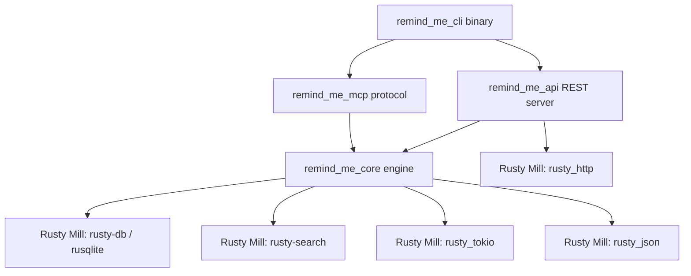

# Architecture & System Design

This document details the architectural principles, data flow, mathematical scoring models, database schema, and crate boundaries of `rusty_remind_me`.

---

## 1. System Design Goals

`rusty_remind_me` is designed as a **high-performance, zero-overhead persistent memory engine** for AI agents.

Key Architectural Tenets:
1. **Predictable Performance**: Microsecond-level SQLite FTS5 query latency and zero runtime Garbage Collection pauses.
2. **Strict Rusty Mill Alignment**: Consumes the `c:\dev\Rusty_Mill` suite of crates (`rusty_tokio`, `rusty-db`, `rusty_json`, `rusty-search`, `rusty_http`, `rusty_lines`, `rusty_term`, `rusty_time`, `rusty_config`) to maintain ecosystem consistency.
3. **Data Parity with `remind-me`**: Identical SQLite Version 19 schema and JSON tool signatures for drop-in interoperability.
4. **Thread Safety & Async Execution**: Thread-safe database access using `Arc<Database>` wrapped in `Mutex<rusqlite::Connection>`, safe for multi-threaded `tokio::spawn` task execution.

---

## 2. Workspace & Crate Boundaries



### Crate Roles
- **`remind_me_core`**: The domain core containing:
  - Database schema creation & migrations (`db/schema.rs`, `db/queries.rs`).
  - ACT-R Memory Vitality calculation engine (`vitality.rs`).
  - Hybrid Search Engine & RRF rank fusion algorithm (`retrieval.rs`).
  - Entity Knowledge Graph management (`entity.rs`).
  - Markdown Wiki compilation (`wiki.rs`).
  - Markdown directory import into the wiki (`wiki_import.rs`) — YAML front
    matter parsing with per-field fallbacks, idempotent upsert on `slug`.
- **`remind_me_mcp`**: The Model Context Protocol layer handling:
  - Stdio JSON-RPC protocol loop (`initialize`, `tools/list`, `tools/call`).
  - Input payload validation & error formatting.
- **`remind_me_api`**: The REST API layer:
  - Async HTTP daemon built with `rusty_http` and `tokio`.
  - Routes: `/health`, `/stats`, `/api/v1/memories`, `/api/v1/search`.
- **`remind_me_cli`**: The unified CLI binary executable (`rusty-remind-me`) handling command line flags and subcommand dispatch (`server`, `api`, `add`, `search`, `get`, `entity`, `wiki-write`, `wiki-read`, `wiki-import`, `stats`).

---

## 3. Core Data Flow

### A. Write Path (`remind_me_add` / `add_memory`)
```
Input (MemoryAddInput)
  │
  ├──► Calculate Decay Rate (get_decay_rate based on category)
  ├──► Calculate Type Prior (get_type_prior) & Source Prior (get_source_prior)
  ├──► Compute Initial Vitality Score (calculate_vitality)
  ├──► Generate Unique Memory ID (UUID v4: mem_...)
  │
  ▼
SQLite Database (`memories` table)
  │
  └──► Automatic SQLite Trigger (`memories_ai`)
         │
         ▼
       SQLite FTS5 Index (`memories_fts`)
```

### B. Read & Search Path (`remind_me_search` / `search_memories`)
```
Search Input (MemorySearchInput query, category, limit, min_vitality)
  │
  ├──► Query Shape Heuristic Router (looks_keyword_shaped, looks_semantic_shaped, looks_temporal_shaped)
  ├──► RRF Weight Selection (choose_rrf_weights)
  │
  ├──► Execute SQLite FTS5 Match Query (bm25 ranking)
  ├──► Filter Dormant Memories (vitality < 0.05 or min_vitality threshold)
  │
  ├──► Execute Reciprocal Rank Fusion (rank_rrf)
  │      └─► Combined Score = (w_keyword / (60 + kw_rank)) + (w_vitality / (60 + vit_rank))
  │
  ├──► Trim by Token Budget (trim_by_token_budget)
  │
  ▼
Returned Search Results (Vec<MemorySearchResult>)
```

---

## 4. Mathematical Models

### A. ACT-R Vitality Decay Model
The memory retention score follows an exponential decay formula inspired by the ACT-R cognitive architecture:

$$\text{Vitality} = \text{Base Weight} \times \sqrt{\text{Access Count} + 1} \times e^{-\text{Decay Rate} \times \text{Days}}$$

Key Parameters:
- **Base Weight**: Product of category prior ($\text{Decision}=1.3$, $\text{Fact}=1.15$, $\text{Action Item}=1.0$) and source prior ($\text{Manual}=1.0$, $\text{Import}=0.85$).
- **Bridge Protection**: When $\text{Access Count} \ge 10$, the effective decay rate is halved ($\text{Decay Rate} \times 0.5$) to simulate consolidation into long-term memory.
- **Dormancy Floor**: Memories with $\text{Vitality} < 0.05$ are flagged dormant and excluded from standard search results.

### B. Reciprocal Rank Fusion (RRF)
Search candidates across keyword and vitality rank lists are fused using RRF:

$$\text{RRF Score}(m) = \sum_{s \in \text{Signals}} \frac{w_s}{K + \text{Rank}_s(m)}$$

Where $K = 60$ is the smoothing constant.

---

## 5. Database Schema Specification (Version 19)

### Main Tables

#### `memories` Table
```sql
CREATE TABLE IF NOT EXISTS memories (
    id          TEXT PRIMARY KEY,
    content     TEXT NOT NULL,
    category    TEXT NOT NULL DEFAULT 'general',
    tags        TEXT NOT NULL DEFAULT '[]',
    source      TEXT NOT NULL DEFAULT 'manual',
    metadata    TEXT NOT NULL DEFAULT '{}',
    created_at  TEXT NOT NULL,
    updated_at  TEXT NOT NULL,
    capture_id  TEXT DEFAULT NULL,
    subject     TEXT DEFAULT NULL,
    predicate   TEXT DEFAULT NULL,
    object      TEXT DEFAULT NULL,
    superseded_by TEXT DEFAULT NULL,
    decay_rate  REAL NOT NULL DEFAULT 0.10,
    vitality    REAL NOT NULL DEFAULT 1.0,
    access_count INTEGER NOT NULL DEFAULT 0,
    last_accessed_at TEXT NOT NULL DEFAULT (datetime('now')),
    deleted_at  TEXT DEFAULT NULL
);
```

#### `memories_fts` Virtual Table (FTS5)
```sql
CREATE VIRTUAL TABLE IF NOT EXISTS memories_fts USING fts5(
    content, category, tags,
    content='memories',
    content_rowid='rowid'
);
```

#### `entities` & `memory_entities` Tables
```sql
CREATE TABLE IF NOT EXISTS entities (
    id          TEXT PRIMARY KEY,
    name        TEXT NOT NULL UNIQUE,
    kind        TEXT DEFAULT NULL,
    aliases     TEXT NOT NULL DEFAULT '[]',
    created_at  TEXT NOT NULL,
    updated_at  TEXT NOT NULL
);

CREATE TABLE IF NOT EXISTS memory_entities (
    memory_id   TEXT NOT NULL REFERENCES memories(id) ON DELETE CASCADE,
    entity_id   TEXT NOT NULL REFERENCES entities(id) ON DELETE CASCADE,
    PRIMARY KEY (memory_id, entity_id)
);
```

#### `wiki_pages` Table
```sql
CREATE TABLE IF NOT EXISTS wiki_pages (
    slug        TEXT PRIMARY KEY,
    title       TEXT NOT NULL,
    content     TEXT NOT NULL,
    topic       TEXT NOT NULL,
    created_at  TEXT NOT NULL,
    updated_at  TEXT NOT NULL
);
```

`slug` being the primary key is what makes `wiki-import` (`wiki_import.rs`)
idempotent: `write_wiki_page` upserts, so re-importing a regenerated directory
revises pages in place. `content` stores the Markdown body *after* front
matter — the three fields that front matter carries (`slug`, `title`, `topic`)
are columns here, so retaining them in the body would duplicate them and leak
YAML into anything that renders the page.

---

## 6. Concurrency & Thread Safety Model

To allow safe multi-threaded async execution across `tokio::spawn` worker tasks without lock contention or data races:
- The `Database` struct wraps `rusqlite::Connection` in `std::sync::Mutex<Connection>`.
- Calling `db.conn()` returns a `MutexGuard<'_, Connection>`, which derefs to `&rusqlite::Connection`.
- Automatic SQLite WAL (Write-Ahead Logging) journal mode (`PRAGMA journal_mode=WAL`) and busy timeouts (`PRAGMA busy_timeout=5000`) enable high-concurrency readers and sequential writers.
