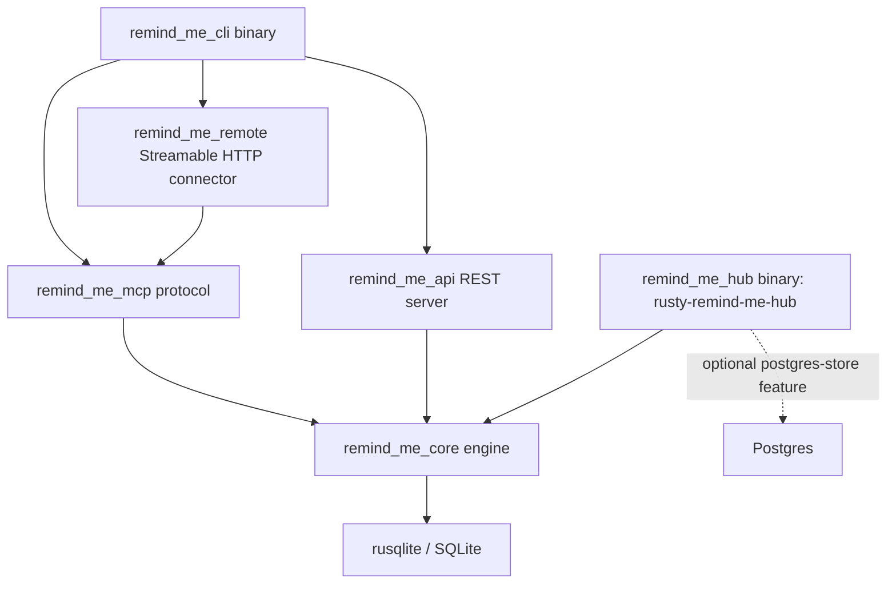

# Architecture & System Design

This document details the architectural principles, data flow, mathematical scoring models, database schema, and crate boundaries of `rusty_remind_me`.

---

## 1. System Design Goals

`rusty_remind_me` is designed as a **high-performance, zero-overhead persistent memory engine** for AI agents.

Key Architectural Tenets:
1. **Predictable Performance**: Microsecond-level SQLite FTS5 query latency and zero runtime Garbage Collection pauses.
2. **Minimal, Call-Site-Justified Dependencies**: No dependency is declared
   speculatively. (This project once aspired to a "Rusty Mill" ecosystem of
   shared crates — `rusty_tokio`, `rusty-db`, `rusty_json`, `rusty-search`,
   `rusty_http`, and others — declared as path dependencies against a
   monorepo that never existed at those paths; the workspace failed to load,
   and not one source file actually called into any of them. They were
   removed. See the "Rusty Mill ecosystem dependencies" comment in the
   workspace `Cargo.toml` for the full account, and re-adopt one only at the
   point it gains a real call site.)
3. **Data Parity with `remind-me`**: Identical SQLite Version 27 schema and JSON tool signatures for drop-in interoperability. The schema is generated from the reference rather than transcribed (§5); the version here is the one `remind_me` itself reports, and a mismatch is what makes a database silently unreadable to it.
4. **Thread Safety & Async Execution**: Thread-safe database access using `Arc<Database>` wrapped in `Mutex<rusqlite::Connection>`, safe for multi-threaded `tokio::spawn` task execution.

---

## 2. Workspace & Crate Boundaries



`remind_me_hub` is its own binary (`rusty-remind-me-hub`), not reached
through the `remind_me_cli` dispatch — it is the central sync point nodes
push to and pull from, not a mode of the client CLI.

### Crate Roles
- **`remind_me_core`**: The domain core containing:
  - Database schema creation & migrations (`db/schema.rs`, `db/queries.rs`).
  - ACT-R Memory Vitality calculation engine (`vitality.rs`).
  - Hybrid Search Engine & RRF rank fusion algorithm (`retrieval.rs`).
  - Entity Knowledge Graph management (`entity.rs`).
  - Markdown Wiki compilation (`wiki.rs`).
  - Markdown directory import into the wiki (`wiki_import.rs`) — YAML front
    matter parsing with per-field fallbacks, idempotent upsert on `slug`.
- **`remind_me_mcp`**: The Model Context Protocol layer handling:
  - Stdio JSON-RPC protocol loop (`initialize`, `tools/list`, `tools/call`).
  - Input payload validation & error formatting.
- **`remind_me_api`**: The REST API layer:
  - Synchronous HTTP daemon hand-rolled on `std::net::TcpListener` — no
    framework, not even `tokio` (matches this workspace's tenet 2: the
    project's aspirational `rusty_http` dependency was never real; see
    above).
  - Routes span far beyond the original four (`/health`, `/stats`,
    `/api/v1/memories`, `/api/v1/search`); `crates/remind_me_api/tests/`
    (bulk ops, dashboard, entities, import/export, reminders, versions, ...)
    is the current, authoritative route inventory — this document does not
    duplicate it for the same reason §5 stopped duplicating the schema DDL.
- **`remind_me_cli`**: The unified CLI binary executable (`rusty-remind-me`) handling command line flags and subcommand dispatch (`server`, `api`, `remote`, `configure`, `add`, `search`, `get`, `entity`, `wiki-write`, `wiki-read`, `wiki-import`, `stats`).
- **`remind_me_remote`**: The Streamable HTTP MCP connector, on `tokio` + `axum` + `rmcp` (the one place this workspace takes on that async stack — every other crate stays synchronous, a deliberate boundary; see `crates/remind_me_remote/src/lib.rs`'s module doc):
  - Secret-path/bearer auth (FT-05) and, when an issuer is configured, a hand-rolled OAuth 2.1 authorization server (FT-07, `docs/adr/0011`).
  - `RemindMeHandler` adapts `remind_me_mcp::McpServer::handle_request` (synchronous) to `rmcp`'s async `ServerHandler` trait via `spawn_blocking`, rather than reimplementing tool/resource/prompt dispatch.
- **`remind_me_hub`**: The central multi-node sync server (`rusty-remind-me-hub` binary) speaking the same push/pull peer protocol `remind_me_core::sync` serves node-to-node, over a pluggable storage trait backed by SQLite or Postgres (`docs/adr/0015`). A hub never pulls; nodes push to and pull from it.

---

## 3. Core Data Flow

### A. Write Path (`remind_me_add` / `add_memory`)
```
Input (MemoryAddInput)
  │
  ├──► Calculate Decay Rate (get_decay_rate based on category)
  ├──► Calculate Type Prior (get_type_prior) & Source Prior (get_source_prior)
  ├──► Compute Initial Vitality Score (calculate_vitality)
  ├──► Generate Unique Memory ID (UUID v4: mem_...)
  │
  ▼
SQLite Database (`memories` table)
  │
  └──► Automatic SQLite Trigger (`memories_ai`)
         │
         ▼
       SQLite FTS5 Index (`memories_fts`)
```

### B. Read & Search Path (`remind_me_search` / `search_memories`)
```
Search Input (MemorySearchInput query, category, limit, min_vitality)
  │
  ├──► Query Shape Heuristic Router (looks_keyword_shaped, looks_semantic_shaped, looks_temporal_shaped)
  ├──► RRF Weight Selection (choose_rrf_weights)
  │
  ├──► Execute SQLite FTS5 Match Query (bm25 ranking)
  ├──► Filter Dormant Memories (vitality < 0.05 or min_vitality threshold)
  │
  ├──► Execute Reciprocal Rank Fusion (rank_rrf)
  │      └─► Combined Score = (w_keyword / (60 + kw_rank)) + (w_vitality / (60 + vit_rank))
  │
  ├──► Trim by Token Budget (trim_by_token_budget)
  │
  ▼
Returned Search Results (Vec<MemorySearchResult>)
```

---

## 4. Mathematical Models

### A. ACT-R Vitality Decay Model
The memory retention score follows an exponential decay formula inspired by the ACT-R cognitive architecture:

$$\text{Vitality} = \text{Base Weight} \times \sqrt{\text{Access Count} + 1} \times e^{-\text{Decay Rate} \times \text{Days}}$$

Key Parameters:
- **Base Weight**: Product of category prior ($\text{Decision}=1.3$, $\text{Fact}=1.15$, $\text{Action Item}=1.0$) and source prior ($\text{Manual}=1.0$, $\text{Import}=0.85$).
- **Bridge Protection**: When $\text{Access Count} \ge 10$, the effective decay rate is halved ($\text{Decay Rate} \times 0.5$) to simulate consolidation into long-term memory.
- **Dormancy Floor**: Memories with $\text{Vitality} < 0.05$ are flagged dormant and excluded from standard search results.

### B. Reciprocal Rank Fusion (RRF)
Search candidates across keyword and vitality rank lists are fused using RRF:

$$\text{RRF Score}(m) = \sum_{s \in \text{Signals}} \frac{w_s}{K + \text{Rank}_s(m)}$$

Where $K = 60$ is the smoothing constant.

---

## 5. Database Schema Specification (Version 27)

The schema is **generated, not hand-written**: `crates/remind_me_core/src/db/`
holds `schema_tables.sql`, `schema_indexes.sql` and `schema_triggers.sql`,
dumped verbatim from a `remind_me` database at `_SCHEMA_VERSION = 27` and
regenerated by `scripts/regenerate_schema.py`. Those files are the
specification; `db/migrations.rs` reconciles any database it opens against
them and stamps `PRAGMA user_version = 27`.

This section used to reproduce the `CREATE TABLE` statements inline. It no
longer does, and the reason is the same one behind the generated schema
itself: a hand-maintained copy of a generated artifact drifts, and drifts
silently. The copy that was here had gone stale in exactly that way — it still
showed `last_accessed_at` (renamed to `accessed_at`), an `entities` table with
no `node_id`, `memory_entities` with cascading foreign keys, and a
`wiki_pages.topic` column — four shapes the schema tests now assert are
*wrong*. A reader trusting this document would have been misled by all four.

### Where to look instead

| For | Read |
| --- | --- |
| The exact current DDL | `crates/remind_me_core/src/db/schema_*.sql` |
| How an existing database is brought to it | `db/migrations.rs` (module docs: reconciliation, not a ladder) |
| Why it is generated rather than transcribed | `db/migrations.rs` module docs, and ADR-0007 |
| Whether this crate matches the reference | `crates/remind_me_core/tests/schema_test.rs` — compares every table, index and trigger by normalised DDL |

### Objects this crate adds beyond the dump

One, deliberately: `vec_embeddings`. `remind_me` stores vectors in a
`sqlite-vec` `vec0` virtual table this crate has no way to load, so it keeps
its own plain table for the bytes
(`docs/adr/0002-embeddings-ollama-and-brute-force-vectors.md`). `vec_chunks`,
the rowid map, *is* part of the generated schema. `schema_test.rs`'s
`OWN_ADDITIONS` is the allowlist, and anything not on it that appears in a live
database fails the parity test.

### Notes that outlive the DDL

`wiki_pages.slug` being the primary key is what makes `wiki-import`
(`wiki_import.rs`) idempotent: `write_wiki_page` upserts, so re-importing a
regenerated directory revises pages in place. `content` stores the Markdown
body *after* front matter — the fields front matter carries are columns here,
so retaining them in the body would duplicate them and leak YAML into anything
that renders the page.

---

## 6. Concurrency & Thread Safety Model

To allow safe multi-threaded async execution across `tokio::spawn` worker tasks without lock contention or data races:
- The `Database` struct wraps `rusqlite::Connection` in `std::sync::Mutex<Connection>`.
- Calling `db.conn()` returns a `MutexGuard<'_, Connection>`, which derefs to `&rusqlite::Connection`.
- Automatic SQLite WAL (Write-Ahead Logging) journal mode (`PRAGMA journal_mode=WAL`) and busy timeouts (`PRAGMA busy_timeout=5000`) enable high-concurrency readers and sequential writers.
